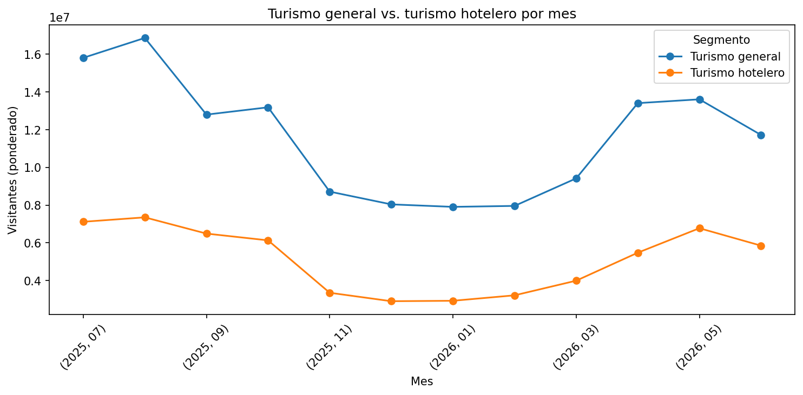
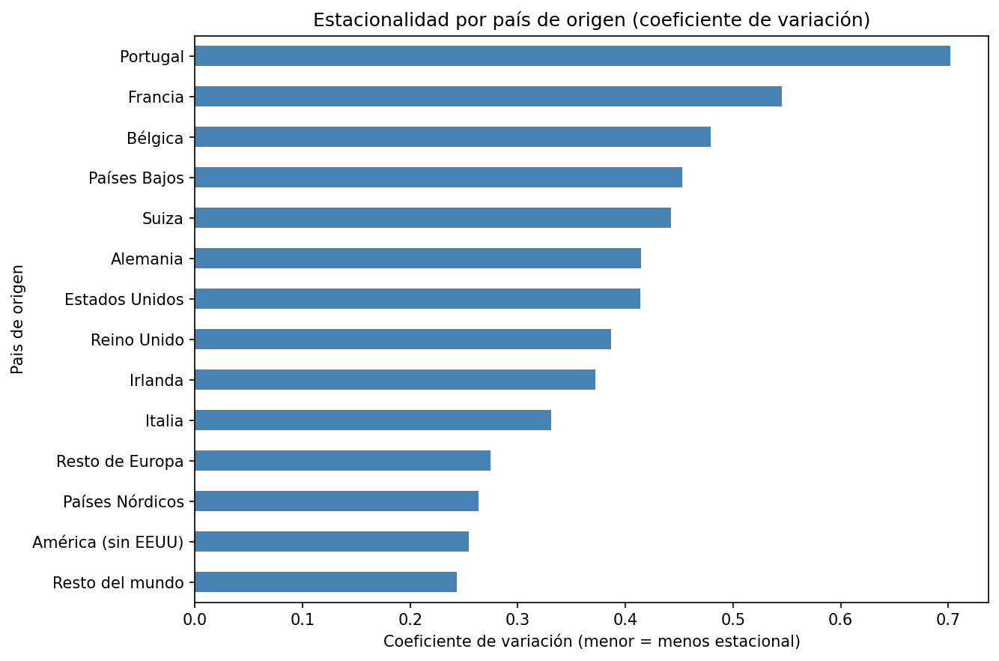
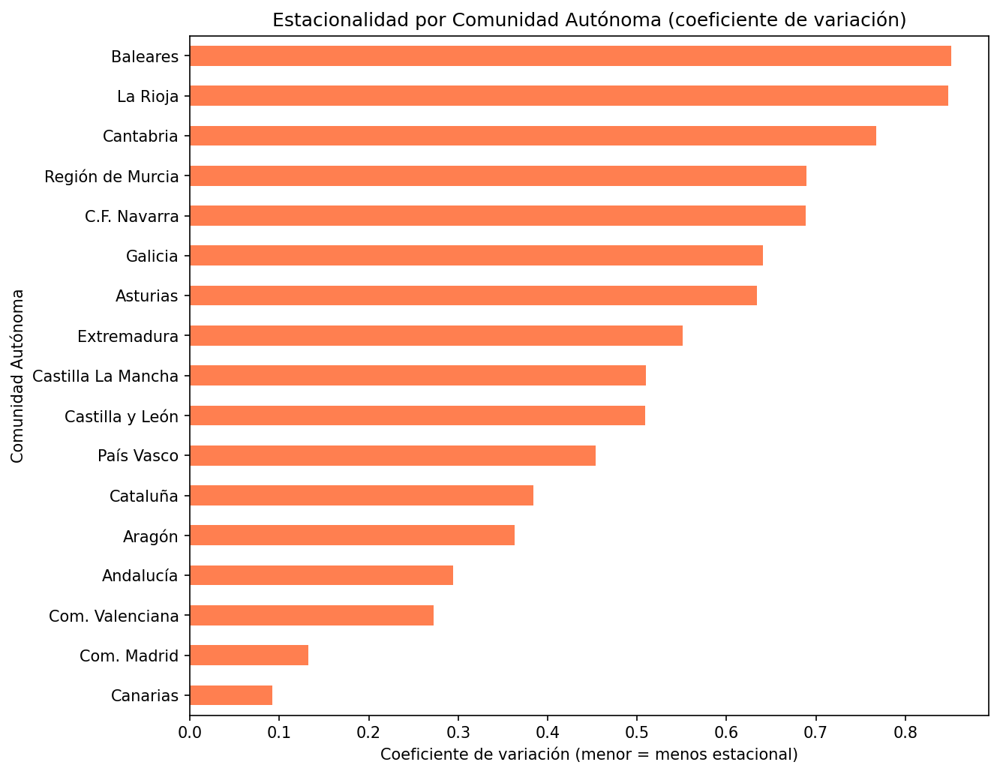
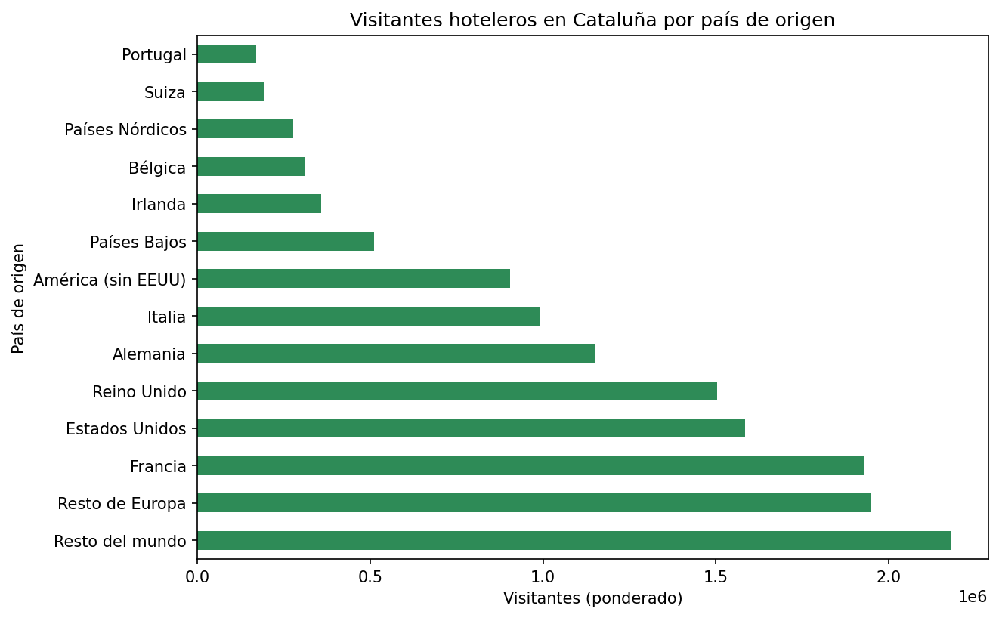
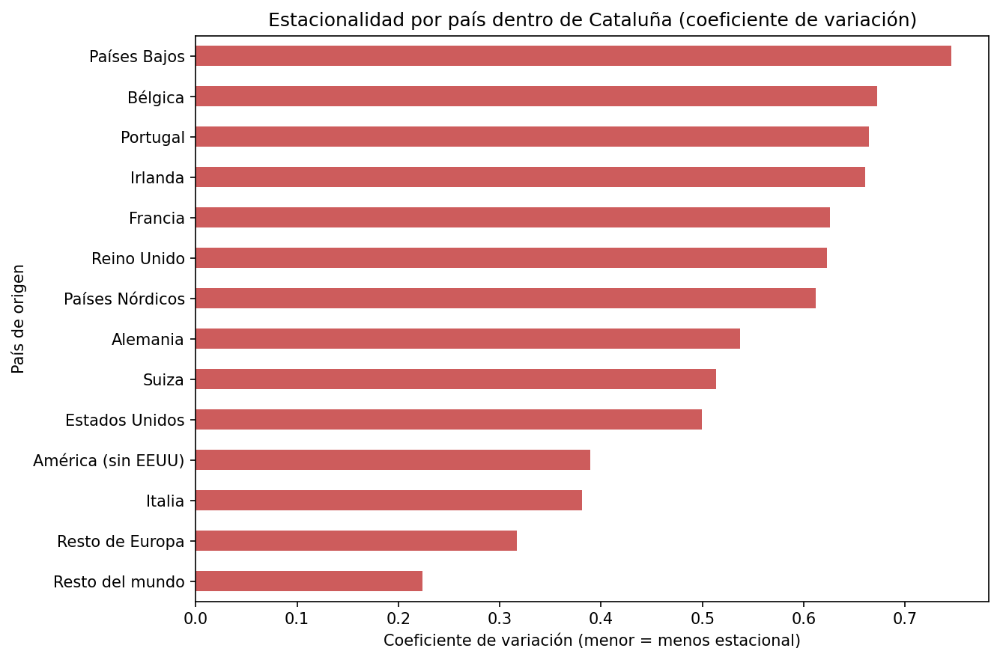

# Fuera de temporada: ¿qué mercados llenan el hotel?

*Análisis de estacionalidad turística por país de origen y Comunidad Autónoma con datos oficiales de Frontur/Egatur (INE), Python y pandas*

## Caso de estudio

Una cadena hotelera de tamaño medio con establecimientos en la Costa Brava y Costa Dorada registra una ocupación muy alta en julio-agosto, pero cae fuertemente el resto del año. La dirección quiere saber si existen mercados de origen con menor estacionalidad en los que apoyar campañas fuera de temporada.

## Fuente de datos

Microdatos oficiales de **Frontur** (INE), julio 2025 - junio 2026 (12 meses), descargados en [ine.es](https://ine.es).

## Proceso

1. **Carga**: unión de 12 ficheros mensuales (~790.000 registros) con pandas
2. **Limpieza**: filtrado de ruido temporal (residuos de años ajenos al periodo real), mapeo de códigos a texto legible, eliminación de valores incompletos
3. **Filtrado al segmento hotelero**: solo turistas que pernoctan en "Hoteles y similares" (390.100 filas, 44,2% del total)
4. **Análisis**: estacionalidad por país y CCAA usando el coeficiente de variación, ponderado con el factor de elevación de la encuesta

## Hallazgos principales

**1. Turismo general vs. turismo hotelero**

La estacionalidad del turismo **hotelero** es distinta a la del turismo general: julio y agosto están mucho más igualados en hoteles, mientras que en el turismo general agosto destaca claramente (probablemente por el peso de vivienda propia/familiar en ese mes).

**2. Estacionalidad por país de origen**

**Italia** es el país individual menos estacional (coef. 0,33) — el mejor candidato para campañas de temporada baja. **Portugal, Francia y Bélgica** son los mercados más concentrados en verano.

**3. Estacionalidad por Comunidad Autónoma**

Canarias y Madrid son las CCAA menos estacionales; Baleares, la más estacional (excluyendo Ceuta y Melilla por muestra insuficiente).

**4. Detalle Cataluña — países por volumen**

Francia, Estados Unidos, Reino Unido y Alemania son los mercados de mayor volumen en el turismo hotelero de Cataluña.

**5. Estacionalidad por país dentro de Cataluña**

Italia se mantiene como el mejor candidato individual también dentro de Cataluña (coef. 0,38), confirmando el hallazgo a nivel España.

**Otros hallazgos:**
- El motivo del viaje (ocio vs. negocio) no explica la diferencia de estacionalidad entre países
- Se detectó y descartó una anomalía de calidad de dato en Ceuta y Melilla (muestra insuficiente en la encuesta)

## Recomendaciones

- Dirigir campañas de temporada baja/media al mercado **italiano**, dado su comportamiento ya repartido a lo largo del año
- Aprovechar el volumen del mercado **británico** con campañas de temporada media
- Para mercados muy estacionales (Francia, Portugal, Bélgica), ofrecer paquetes de temporada media (mayo-junio, septiembre-octubre) en vez de intentar moverlos fuera de su patrón vacacional habitual

## Herramientas

Python · pandas · matplotlib

## Autora

Ksenia Kucherenko — [LinkedIn](https://www.linkedin.com/in/ksenia-k-671896394) · en transición hacia analista de datos junior freelance
